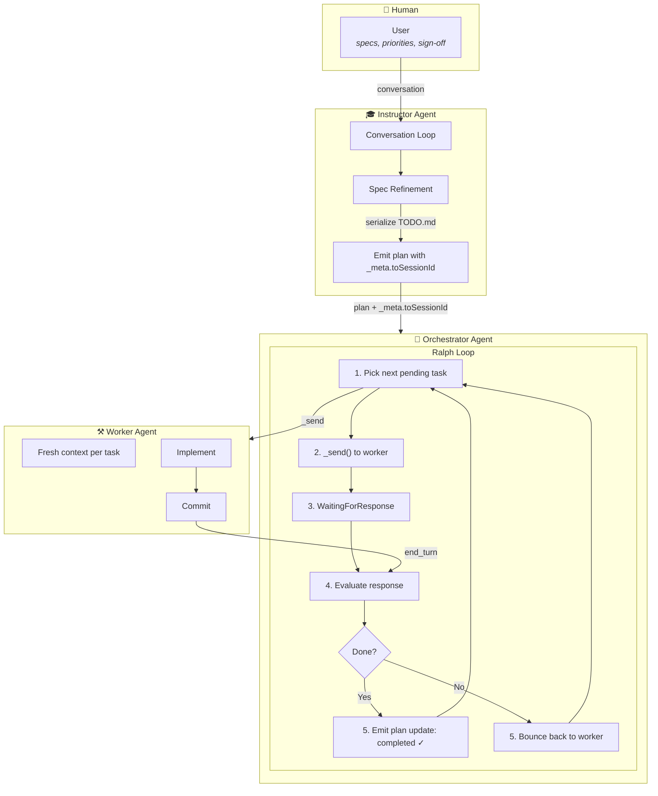
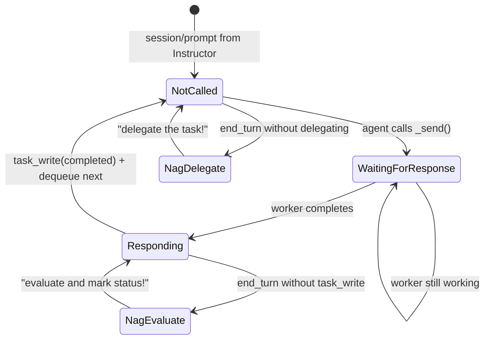
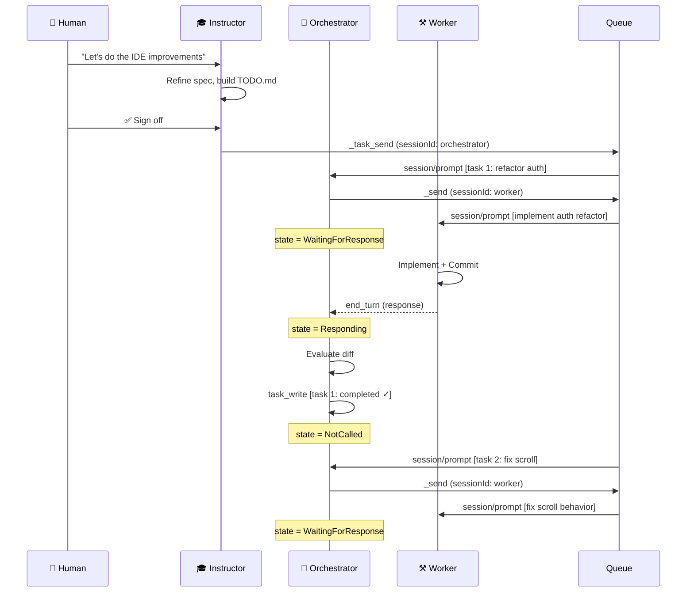

# Tripartite Agent Architecture

A spec-driven development system built on ACP v1 extensions with prompt queues and Ralph loop orchestration.



---

## State Machine: Orchestrator Delegation Loop



---

## Prompt Queue: The Core Primitive

$$Q = \langle p_1, p_2, \dots, p_n \rangle \quad \text{where } p_i \in \text{session/prompt inputs}$$

The prompt queue is the fundamental primitive. Everything else is logic on top:

- **Task list** = prompt queue + plan status tracking
- **Compaction** = enqueue "summarize what you did" prompt after task list completes
- **Instructor → Orchestrator** = `_task_send` enqueues prompts to orchestrator's queue
- **Orchestrator → Worker** = `_send` enqueues a single prompt to worker's queue



---

## The Invariants

$$\boxed{\text{Plan} \equiv \text{TODO.md} \equiv \text{Queue State}}$$

| Principle | Why |
|-----------|-----|
| **One worker, one orchestrator, one instructor** | Each has a dedicated context window for its one job |
| **Fresh context per task** | No pollution — worker only sees the current task spec |
| **Orchestrator never implements** | Evaluation is adversarial — you can't grade your own homework |
| **Instructor never evaluates code** | Human interaction is a full-time job, code review is another |
| **TODO.md is the source of truth** | User edits it, instructor serializes it, orchestrator loops over it |

---

## ACP Extensions (v1)

We only need **two** custom methods using the reserved underscore prefix:

$$\text{Extensions:} \;\; \{\texttt{\_list\_sessions},\; \texttt{\_send}\}$$

### `_list_sessions`
Discover available agent sessions. Returns list of session IDs with metadata.

### `_send`
Orchestrator delegates work to worker by enqueuing a single prompt to worker's queue. `_meta` carries target `sessionId`.

---

## Metadata-Driven Orchestration

Everything else uses **standard `session/update` plan notifications** with `_meta` for routing and state:

### Instructor → Orchestrator (Task Assignment)

```json
{
  "sessionUpdate": "plan",
  "entries": [
    {
      "content": "Refactor auth module",
      "priority": "high",
      "status": "pending"
    }
  ],
  "_meta": {
    "toSessionId": "sess_orchestrator_7"
  }
}
```

Backend sees the plan + `toSessionId` in `_meta`, enqueues the prompts to that session.

### Orchestrator Status Updates

```json
{
  "sessionUpdate": "plan",
  "entries": [
    {
      "content": "Refactor auth module",
      "priority": "high",
      "status": "in_progress",
      "_meta": {
        "assignedSession": "sess_worker_42",
        "orchestratorState": "WaitingForResponse"
      }
    }
  ]
}
```

Standard plan update with `_meta` on individual entries carrying orchestration state.

### Why Only Two Custom Methods?

- **Plans are plans** — standard `sessionUpdate: "plan"` needs no modification
- **Routing is metadata** — `_meta.toSessionId` tells backend where to send it
- **State is metadata** — `_meta` on plan entries tracks orchestration state
- **`_send` is different** — it's "execute this single prompt now", not "here's a task list"

---

## The Full Stack

$$\underbrace{\text{User} \leftrightarrow \text{Instructor}}_{\text{conversation}} \;\;\xrightarrow{\text{plan + \_meta}}\;\; \underbrace{\text{Orchestrator}}_{\text{Ralph loop}} \;\;\xrightarrow{\texttt{\_send}}\;\; \underbrace{\text{Worker}}_{\text{fresh context}}$$

---

## Implementation Strategy

**Build on v1, adopt upstream when stable.** No coupling to moving targets.

- **Plans** = standard `sessionUpdate: "plan"` with entries, no modifications needed
- **Orchestration** = backend state management in Rust (`session.rs`, `manager.rs`)
- **Queue** = backend primitive, not a protocol extension
- **Custom methods** = underscore-prefixed JSON-RPC methods per ACP extensibility

The protocol only sees `session/prompt` going in and `session/update` coming out. The orchestration state machine, nagging logic, and queue management all live in the client backend.

---

## Why Tripartite?

**Worker** — just does the work. No evaluation, no planning, no human interaction. Pure implementation agent.

**Orchestrator** — just evaluates. "Did the worker actually do what the task asked? Is it good enough? Does it need to try again? Or is it done and we move on?" That's a full-time job because you have to read diffs, understand intent, judge quality.

**Instructor** — just talks to the human. Understands what they want, refines the spec, translates vague ideas into concrete tasks. That's also a full-time job because humans are messy and iterative.

Collapse orchestrator into instructor, and you get an agent trying to hold a conversation while simultaneously reviewing code diffs. Context gets polluted, priorities conflict.

Collapse orchestrator into worker, and you lose the adversarial evaluation step — the worker just marks its own work as done, which is the whole thing Ralph loops struggle with.

Three focused agents, each with one job, each with a fresh context window dedicated to that one job.
